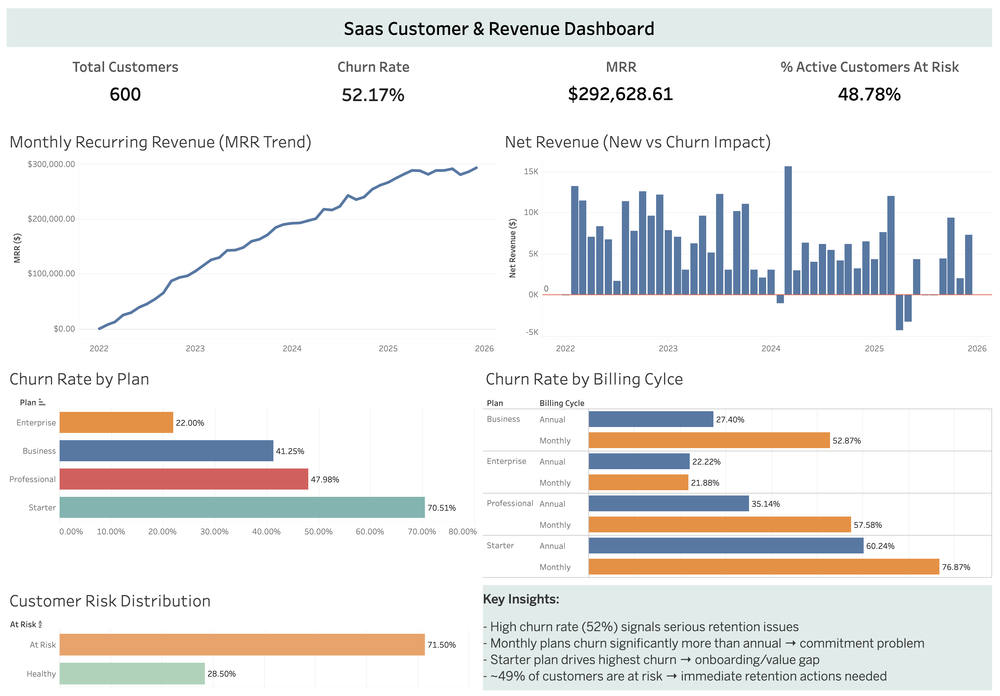

**SaaS Churn & Revenue Analysis**

**Overview**
In this project, I analyzed customer churn, retention drivers, and revenue performance for a SaaS business (CloudTask Pro). Using Excel for exploratory analysis and Tableau for visualization, I investigated churn trends, compared subscription segments, evaluated unit economics (CLV vs CAC), and built a dashboard to support data-driven retention decisions.

**Business Context**
CloudTask Pro is a subscription-based SaaS company serving businesses of different sizes. As the company grows, understanding why customers churn, which segments are most at risk, and how churn impacts revenue becomes critical for sustainable growth.

This analysis focuses on identifying where churn occurs, why it happens, and how it impacts business performance, with the goal of supporting better retention and pricing strategies.

**Business Questions**
- What is the overall churn rate, and how has the monthly churn rate trended over the past 4 years? Is churn improving or getting worse?
- Which subscription plan (Starter, Professional, Business, Enterprise) has the highest churn rate? Does billing cycle (monthly vs. annual) significantly impact retention?
- What are the top 3 reasons customers churn, and do these reasons differ by plan type or company size?
- Calculate the average Customer Lifetime Value (CLV) by plan. Compare this to the Customer Acquisition Cost (CAC). Which plans are the most and least profitable?

**Dataset**
The analysis is based on two datasets: 
1. Subscriptions dataset: customer-level data. Used for churn analysis, segmentation, and identifying at-risk customers
3. Monthly revenue dataset: aggregated monthly metrics for the last 5 years. Used to analyze revenue trends and assess the business impact of churn.

**Methodology**
To answer the business questions, I structured the analysis into five key stages, moving from descriptive analysis to actionable insights.

1. Churn Measurement & Trend Analysis
I first established baseline retention performance by calculating the overall churn rate and analyzing monthly churn trends over time. This helped determine whether churn was improving, stabilizing, or deteriorating.

2. Customer Segmentation
To identify where churn is concentrated, I segmented customers by subscription plan and billing cycle. This allowed me to compare retention patterns across different pricing tiers and commitment levels.

3. Churn Driver Exploration
I examined churn reasons and analyzed how they vary across segments (plan and company size) to understand the underlying causes of churn, such as pricing sensitivity, product limitations, or external business factors.

4. Unit Economics Analysis
To evaluate business impact, I estimated Customer Lifetime Value (CLV) using churn-based lifespan and compared it to Customer Acquisition Cost (CAC) across plans. This helped identify which segments are most and least profitable.

5. Risk Identification (Forward-Looking Analysis)
Finally, I identified at-risk customers based on behavioral indicators (low feature usage and low NPS). This step shifts the analysis from historical churn to proactive retention opportunities.

**Kry Metrics and Definitions**
- Churn Rate = Churned Customers / Total Customers
- Customer Lifespan ≈ 1 / Churn Rate
- CLV (Customer Lifetime Value) = Avg Monthly Revenue × Lifespan
- CLV:CAC Ratio = CLV / CAC
- At-Risk Customers:
  - Feature usage < 40%
  - NPS score < 4
 
**Key Insights**
- Overall churn rate is ~52%, indicating significant retention challenges
- Churn has stabilized but remains consistently high, rather than improving over time
- The Starter plan has the highest churn, making it the weakest segment
- Monthly subscriptions churn significantly more than annual plans, suggesting lower customer commitment
- The most common churn drivers relate to pricing pressure, customer closure, and product/service limitations
- Higher-value plans (Business, Enterprise) show stronger retention and better unit economics
- Although MRR grows steadily, net revenue volatility indicates churn offsets new customer growth
- Approximately 49% of active customers are at risk, highlighting a large opportunity for proactive retention

**Dashboard**
Interactive Tableau dashboard: https://public.tableau.com/views/RevenueandChurnAnalysis/Dashboard1?:language=en-US&:sid=&:redirect=auth&:display_count=n&:origin=viz_share_link

  

The dashboard highlights:
- Total customers, churn rate, MRR, and at-risk share
- MRR trend over time
- Net Revenue retention
- Churn comparison by plan and billin cycle
- Custoemr risk distribution

**Business Recommendations**
- Improve onboarding and early value delivery for Starter plan customers
- Encourage customers to shift from monthly to annual subscriptions
- Monitor and intervene with low engegement/low NPS customers early
- Focus retention strategies on high-value customer segments while improving lower-tier positioning

**Project Files**

analysis.xlsx → detailed exploratory analysis
dashboard.png → Tableau dashboard

**Limitations**
- CAC assumed to be uniform across plans
- At-risk thresholds are simplified and not model-based
- Dataset is simulated and may not reflect full real-world complexity
