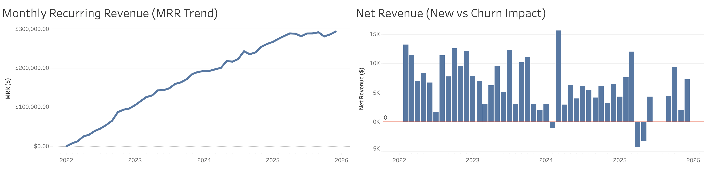
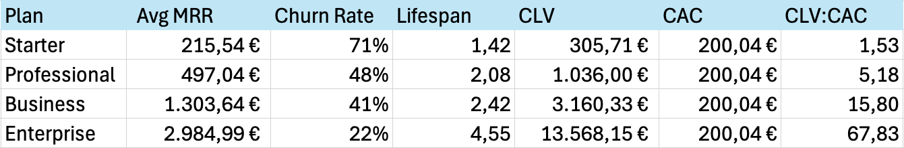

# SaaS Churn & Revenue Analysis

## Project Background

This project analyzes customer churn behavior, subscription performance, and revenue trends for a SaaS business (CloudTask Pro).

As subscription-based companies scale, understanding where churn occurs, why it happens, and how it impacts revenue and profitability becomes essential for sustainable growth. Retention is not only a product or customer success problem, but a key driver of long-term business value.

The objective of this analysis is to uncover the main drivers of churn, evaluate differences across customer segments, and assess the impact on revenue using core SaaS metrics such as churn rate, Monthly Recurring Revenue (MRR), and Customer Lifetime Value (CLV).

---

## Data Structure

The analysis is based on two datasets that capture different perspectives of the business.

The **subscriptions dataset** provides a customer-level view, including plan type, billing cycle, churn status and reasons, as well as behavioral indicators such as feature usage and NPS scores. This dataset enables a deeper understanding of *who churns and why*, allowing for segmentation across customer groups.

The **monthly revenue dataset** captures aggregated business performance over time, including MRR, new and churned customers, and net revenue. This dataset is used to evaluate how customer behavior translates into overall revenue dynamics.

Together, these datasets allow the analysis to connect **individual customer behavior with overall business performance**, even though they operate at different levels of granularity.

---

## Executive Summary

### 1. Overview

The analysis reveals several structural challenges in customer retention and long-term profitability. While the business continues to grow in terms of revenue, underlying customer dynamics indicate inefficiencies that may limit sustainable growth if left unaddressed.

The overall churn rate of approximately 52% suggests that a significant portion of customers do not remain long enough to generate meaningful long-term value. At the same time, nearly half of the active customer base shows signs of risk, indicating that future churn is likely to remain high without targeted intervention.

---

### 2. Churn & Customer Segmentation

Customer retention remains a core challenge for the business. Although churn stabilizes at around 3–5% per month as the customer base grows, there is no clear downward trend, indicating that retention issues are persistent rather than improving over time.

Retention varies significantly across customer segments. Customers on the Starter plan exhibit the highest churn rates, suggesting potential gaps in perceived value, onboarding experience, or product-market fit. In contrast, higher-tier plans demonstrate stronger retention and longer customer lifespans.

Billing structure further reinforces this pattern. Customers on monthly subscriptions consistently churn more than those on annual plans, highlighting the importance of long-term commitment in reducing churn risk.

---

### 3. Revenue, Unit Economics & Customer Risk

From a revenue perspective, the business shows steady growth in Monthly Recurring Revenue (MRR), indicating successful customer acquisition and expansion. However, net revenue presents a more volatile pattern, with fluctuations and occasional negative periods, suggesting that gains from new customers are partially offset by churn.

Profitability analysis highlights a strong imbalance between customer segments. Lower-tier plans, particularly the Starter plan, generate relatively low lifetime value compared to acquisition cost, resulting in weak unit economics. In contrast, higher-tier plans such as Business and Enterprise demonstrate significantly stronger CLV:CAC ratios and drive the majority of long-term value.

At the same time, approximately 49% of active customers are classified as at risk based on engagement and satisfaction signals. This represents a substantial opportunity for proactive retention strategies, shifting the focus from analyzing churn after it occurs to preventing it before it happens.

## Recommendations

The findings suggest several strategic priorities to improve retention and long-term profitability.

Improving onboarding and early value delivery is critical, particularly for Starter plan customers who are most vulnerable to early churn. At the same time, encouraging customers to transition from monthly to annual billing could strengthen commitment and reduce churn risk.

Retention efforts should also become more proactive. Monitoring behavioral signals such as low feature usage or declining NPS scores can enable early intervention before customers disengage completely.

Finally, the company should re-evaluate the role of lower-tier plans within its business model. While they may drive initial acquisition, their low profitability suggests a need to optimize pricing, cost structure, or upgrade pathways toward higher-value segments.

---

## Limitations

This analysis is based on a simplified dataset and includes several assumptions. Customer Acquisition Cost (CAC) is treated as constant across segments, and at-risk classification is based on threshold-based logic rather than predictive modeling.

Additionally, as the dataset is simulated, real-world complexities such as seasonality, market conditions, and operational constraints may not be fully captured.
