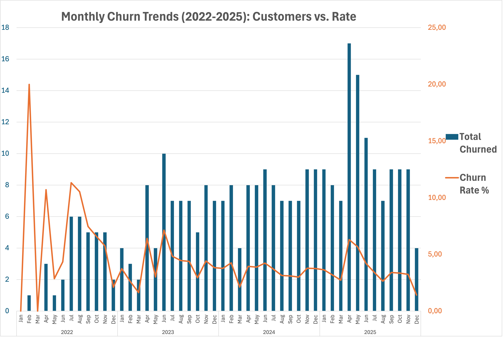

# SaaS Churn & Revenue Analysis

## Project Background

This project analyzes customer churn behavior, subscription performance, and revenue trends for a SaaS business (CloudTask Pro).

As subscription-based companies scale, understanding where churn occurs, why it happens, and how it impacts revenue and profitability becomes essential for sustainable growth. Retention is not only a product or customer success problem, but a key driver of long-term business value.

The objective of this analysis is to uncover the main drivers of churn, evaluate differences across customer segments, and assess the impact on revenue using core SaaS metrics such as churn rate, Monthly Recurring Revenue (MRR), and Customer Lifetime Value (CLV).

The analysis was conducted using Excel for data exploration and calculations, and Tableau for visualization and presentation. 

An interactive Tableau dashboard can be viewed here: [View Dashboard](https://public.tableau.com/views/RevenueandChurnAnalysis/Dashboard1?:language=en-US&publish=yes&:sid=&:redirect=auth&:display_count=n&:origin=viz_share_link)

---

## Data Structure

The analysis is based on two datasets that capture different perspectives of the business.

The **subscriptions dataset** provides a customer-level view, including plan type, billing cycle, churn status and reasons, as well as behavioral indicators such as feature usage and NPS scores. This dataset enables a deeper understanding of *who churns and why*, allowing for segmentation across customer groups.

The **monthly revenue dataset** captures aggregated business performance over time, including MRR, new and churned customers, and net revenue. This dataset is used to evaluate how customer behavior translates into overall revenue dynamics.

Together, these datasets allow the analysis to connect **individual customer behavior with overall business performance**, even though they operate at different levels of granularity.

---

## Executive Summary

### 1. Overview

The analysis reveals several structural challenges in customer retention and long-term profitability. While the business shows strong revenue growth, underlying customer dynamics indicate inefficiencies that may limit sustainable growth if left unaddressed.

The overall churn rate is approximately **52%**, indicating that more than half of customers do not remain long enough to generate meaningful long-term value. On a monthly basis, churn averages around **4.5%**, which is at the higher end of typical SaaS benchmarks. Although churn stabilizes at around **3–4% from 2023 onward**, it has plateaued rather than improved, suggesting persistent retention issues.

At the same time, approximately **49% of active customers are classified as at risk**, indicating that a significant portion of the current customer base may churn in the near future without targeted intervention.

Overall, the business demonstrates strong growth potential, but sustained high churn and weak performance in lower-tier segments limit its ability to convert growth into long-term profitability.

---

### 2. Churn & Customer Segmentation

Customer retention varies significantly across plans, billing structures, and customer types.

The **Starter plan shows the highest churn rate at approximately 70.5%**, making it the most problematic segment. In contrast, higher-tier plans demonstrate stronger retention and longer customer lifespans.

Billing cycle has a substantial impact on churn behavior. Customers on **monthly subscriptions churn at around 60.5%**, compared to **40.3% for annual subscriptions**, highlighting the importance of long-term commitment in improving retention.

Customer characteristics also play a role. Smaller companies (1–50 employees) show the highest volatility and churn sensitivity, while acquisition channels further differentiate performance. For example, **Paid Ads exhibit churn rates above 80%**, indicating low-quality acquisition despite moderate volume, whereas **Organic Search delivers higher customer volume with relatively lower churn**.

Churn drivers further reinforce these patterns. The top reasons for churn are **Budget Cuts (~17%)**, **Price Too High (~16%)**, and **Company Closure (~15%)**, pointing to strong pricing pressure. Starter customers tend to be more price-sensitive, while higher-tier plans show churn driven more by product limitations and support quality.

---

### 3. Revenue, Unit Economics & Customer Risk

From a revenue perspective, the business demonstrates strong growth in Monthly Recurring Revenue (MRR), increasing from approximately **€7K to €290K** over the observed period.

However, net revenue shows clear volatility, with several negative months where churned revenue exceeded new revenue. This indicates that while acquisition is strong, retention challenges continue to offset gains, limiting stable revenue expansion.

Unit economics reveal a significant imbalance across customer segments. Customer Lifetime Value (CLV) increases substantially across plans, from approximately **€305 for Starter customers to €13.6K for Enterprise customers**. This means Enterprise customers generate over 40x more lifetime value than Starter customers, highlighting a significant imbalance in value contribution across segments.

The Starter plan shows weak profitability, with a **CLV:CAC ratio of ~1.5**, indicating limited value generation relative to acquisition cost. In contrast, Enterprise customers demonstrate extremely strong unit economics, with a **CLV:CAC ratio of ~68**, while Professional and Business plans also perform well above typical SaaS benchmarks (>3).

It should be noted that CAC is applied as a company-wide average (~€200), meaning comparisons are directional rather than plan-specific.

Finally, customer risk analysis highlights a major opportunity for proactive retention. Customers who churn show significantly lower engagement and satisfaction, with average feature usage of approximately **27%** and NPS scores around **3**, compared to retained customers with **~55% usage** and **~5.8 NPS**.

Using threshold-based indicators (feature usage <40% and NPS <4), approximately **49% of active customers are classified as at risk**, suggesting a large portion of the customer base may be vulnerable to churn without intervention.

## Recommendations

The analysis highlights several targeted opportunities to improve retention, stabilize revenue, and strengthen overall profitability.

- **Fix Starter plan retention and profitability**  
  With a churn rate of ~70% and a CLV:CAC ratio of ~1.5, the Starter segment generates limited long-term value. Improving onboarding, clarifying product value, and introducing upgrade pathways to higher-tier plans should be prioritized.

- **Shift customers from monthly to annual billing**  
  Monthly subscriptions show significantly higher churn (~60.5%) compared to annual (~40.3%). Encouraging annual plans through pricing incentives or discounts could materially improve retention and customer lifetime value.

- **Optimize acquisition channels**  
  Paid Ads customers exhibit churn rates above 80%, indicating low-quality acquisition. In contrast, Organic Search delivers higher volume with relatively lower churn. Marketing efforts should be reallocated toward more sustainable channels.

- **Reduce revenue volatility by focusing on retention**  
  Although MRR has grown from ~€7K to ~€290K, net revenue shows fluctuations and occasional negative periods. Strengthening retention among existing customers is likely more cost-effective than increasing acquisition alone.

- **Implement proactive churn prevention using risk signals**  
  Approximately 49% of active customers are classified as at risk based on feature usage (<40%) and NPS (<4). Monitoring these indicators and triggering early interventions (e.g., customer success outreach) can significantly reduce future churn.

---

## Limitations

This analysis is based on a simplified dataset and includes several assumptions. Customer Acquisition Cost (CAC) is treated as constant across segments, and at-risk classification is based on threshold-based logic rather than predictive modeling.

Additionally, as the dataset is simulated, real-world complexities such as seasonality, market conditions, and operational constraints may not be fully captured.

---

## Project Files

- analysis.xlsx → detailed exploratory analysis and calculations  
- overview.png, revenue_trend.png, clv_cac.png → visual outputs  
